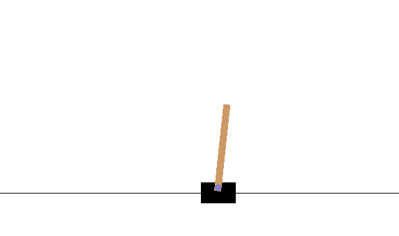
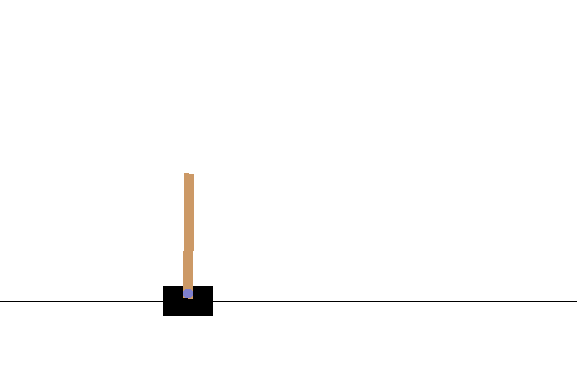

# Policy Gradient with Tensorflow, R, OpenAI(CartPole)
This is a policy gradient implementation using  
* R
* OpenAi Gym (CartPole-v0)
* Tensorflow

# Screenshot

## During Training

## After Training

# File Description
* train.R 
  * main train file
  * it's used to train the policy and value model
* test.R 
  * render the gamplay done by the model
* doc/
  * further detail explanation
* helpers/
  * most functions are defined here
* log/ 
  * game result of training step
* tests/
  * unittests files are located here

